<div align="center">
  <h1 style="font-size:48px; margin:0.2em 0;">JengaBot</h1>
  <p style="font-size:16px; margin:0 0 0.8em 0; color:#555;">Interactive Jenga-playing robot</p>
  
</div>

[Full Demo](https://youtu.be/ButhJ49mhdo)

---

# Table of Contents

[1. Project Overview](#1-project-overview)  

[2. System Architecture](#2-system-architecture)  

[3. Technical Components](#31-technical-components-manipulation)  
- [3.1. Manipulation](#31-technical-components-manipulation)  
- [3.2. Computer Vision](#32-technical-components-computer-vision)  
- [3.3. Brain Node](#33-technical-components-brain-node)  
- [3.4. UI Node](#34-technical-components-ui-node)  
- [3.5 Closed-Loop Operation](#35-technical-components-closed-loop-operation)  
- [3.6 Custom End-Effector](#36-technical-components-custom-end-effector)  
- [3.7 System Visualisation](#37-technical-components-system-visualisation)

[4. Installation and Setup](#4-installation-and-setup)  

[5. Running the System](#5-running-the-system)

[6. Results and Demonstration](#6-results-and-demonstration)

[7. Discussion and Future Work](#7-discussion-and-future-work)

[8. Contributors and Roles](#8-contributors-and-roles)

[9. Repo Structure](#9-repo-structure)

[10. References](#10-references)

---

# 1. Project Overview

## Background and Problem Context  
Over 40% of children spend significant hours alone at home each week, often without meaningful interaction. This isolation leads many to rely heavily on screens, which can reduce focus, hinder social development, and negatively affect emotional well‑being. Parents are increasingly concerned about finding safe and engaging alternatives that can keep their children stimulated while also supporting healthy growth.  

## Target Customers/Users  
The primary users are children who need interactive companionship during periods of solitude. Parents are the key customers, as they seek reliable solutions that reduce screen dependency and provide peace of mind. Educational institutions and after‑school programs may also benefit from such systems, using them to enhance learning and social engagement in structured environments.  

## System Purpose  
The robot is designed to provide interactive companionship and stimulating activities for children, offering a safe and engaging alternative to passive screen time. Fostering attention, creativity, and social interaction helps improve emotional well‑being and developmental outcomes. At the same time, it reassures parents that their children are meaningfully engaged even when alone at home.  

## Solution - JengaBot
JengaBot is a robot that playes Jenga against a human player. The robot is able to find a block that is suitable to remove, push it partially out, then pull and grasp it, removing it from the tower before placing the block on the top of the tower. The robot uses [computer vision](#32-technical-components-computer-vision) to find the location of the tower and the blocks that are in the tower. The robot uses [manipulation](#31-technical-components-manipulation) to execute push-pull-place actions. Further, it uses a custom [force sensor](#36-technical-components-custom-end-effector) to determine whether a block is suitably loose to remove. The [brain node](#33-technical-components-brain-node) combines and executes these components, coordinating an entire closed-loop game of the Jenga against the user.

## Video
[Full Demo](https://youtu.be/ButhJ49mhdo)

---

# 2. System Architecture

## Core Functionality
This ROS2-based robot plays Jenga by combining **computer vision**, **decision-making**, and **force-sensitive manipulation**.  
It identifies safe blocks, executes push-pull-place actions, and interacts with a human via a UI.

## System Architecture Diagram

A full System Architecture diagram is shown below, detailing the implemented ROS2 packages, nodes, topics, actions. Interactions between nodes are also indicated.

<div align="center">
  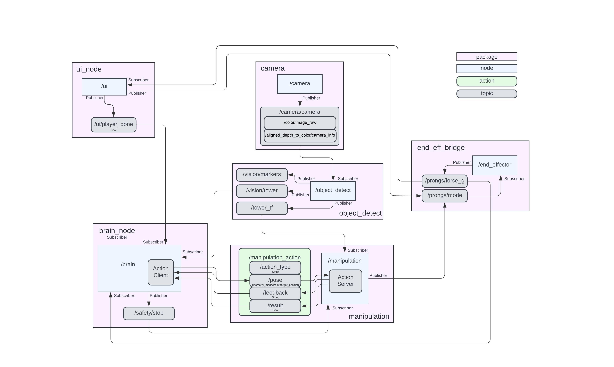
</div>

## State Machine Diagram

A State Machine diagram is shown below, indicating the logical flow of the program. This logic is largely implemented within the [brain node](#33-technical-components-brain-node) and implments the [closed-loop operation](#35-technical-components-closed-loop-operation).

<div align="center">
  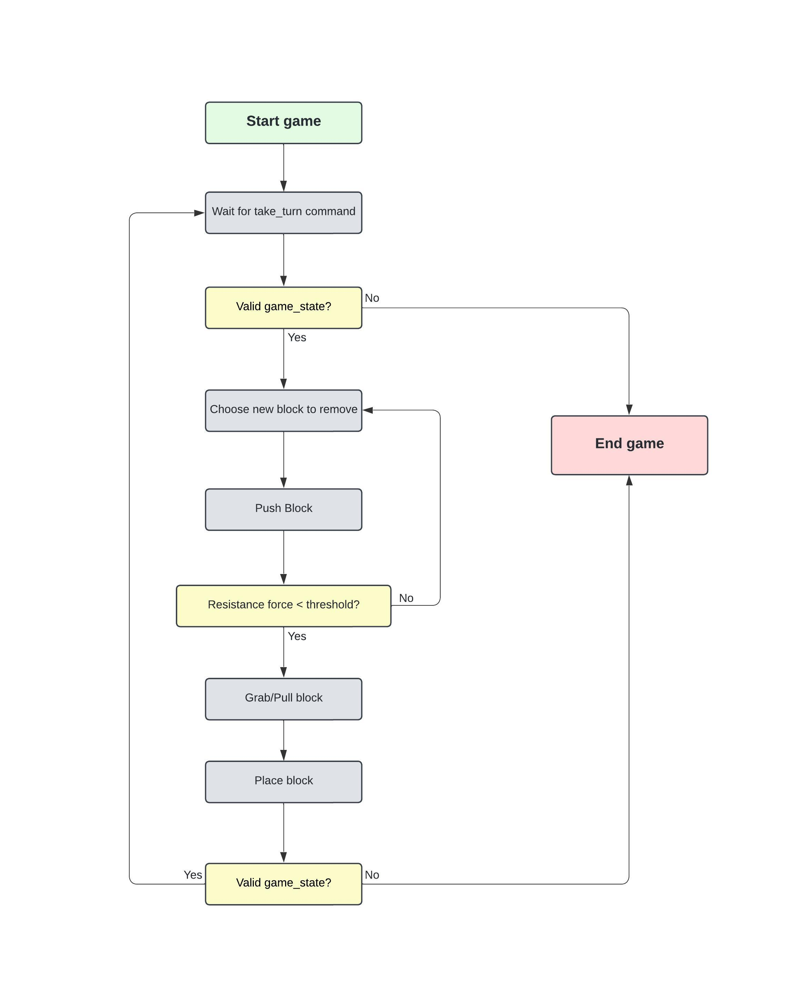
</div>

## Packages & Nodes

### `ui_node`

The UI allows users to interface with the robot. 

Users are able to:
- begin JengaBot's turn (start push/pull/place sequence)
- manually open, fully and partially close the end effector
- view the current force sensor output

### `brain_node`

The brain node dictates the central logic, decision-making and sequencing. It computes the optimal blocks to remove, and listens to the force sensor to determine whether a block is removable. The brain node also calls **Push**, **Pull** and **Place** moves via the `manipulation_action` action server.

### `object_detect`

The object_detect node uses computer vision to determine the location of the tower. It also determines which blocks are in the tower. See [computer vision](#32-technical-components-computer-vision) for more details.

### `manipulation`

The manipulation node exposes the `manipulation_action` action server. It defines various move types which are used to manipulate the UR5e.

### `end_eff_bridge`

The end_eff_bridge node interfaces with the Arduino via serial communication. It broadcasts the force sensor reading, and controls the positions of the servos.

## Custom Message Types

### `manipulation_action`

```
string action_type
geometry_msgs/Pose pose   # optional, must include either pose or tf
string tf                 # optional, TF frame name

bool result
string feedback
```

- action_type: Defines what manipulation to perform

  e.g. "push_move", "place_move", "approach_move", "linear_move", etc.

- pose: A 6-DoF target pose (position + orientation)

- tf: Name of a TF frame whose pose should be used instead of a fixed Pose

- result: true if the manipulation succeeded; false if it failed or was aborted

- feedback: provides updates of path planning, movement etc.

---

### `Tower`

```
TowerRow[] rows
```

- rows: An array of `TowerRow` objects, each representing a row of blocks in the tower.

### `TowerRow`

```
bool pos1
bool pos2
bool pos3
```

- pos1: True if the first block in the row is occupied.
- pos2: True if the second block in the row is occupied.
- pos3: True if the third block in the row is occupied.


# 3.1. Technical Components: Manipulation

The **Manipulation Node** is responsible for executing robot arm actions using ROS 2, MoveIt, and TF2.  
It provides an **action server** (`manipulation_action`) that accepts goals specifying either a target pose or a TF frame.  

Based on the requested `action_type`, the node dispatches to specialised action classes, e.g. **PushMoveAction**, **PullMoveAction**.

Some actions use other actions within them. For example, a **PullMoveAction** constists of an **ApproachMoveAction**, and a sequence of other **LinearMoveAction**s. 

The node integrates with MoveIt’s **MoveGroupInterface** to plan and execute trajectories. It also sets up **collision objects** (walls, table, ceiling) in the planning scene to ensure safe motion planning. Orientation and joint constraints can be applied to enforce specific end-effector orientations or joint limits.  

The node continuously monitors goals, supports cancellation, and reports success or failure back to the client.

Movements stop instantly if force sensor sets /safety/stop to true.

### Action types

The following actions are defined as C++ classes:
- `ApproachMove` - Approach any position/block on the tower
- `PushMove` - Push a block out from the tower
- `PullMove` - Grab a block and pull it from the tower
- `PlaceMove` - Place a grabbed block on top of the tower
- `LinearMove` - Move linearly (in Cartesian space) to a position/block
- `ConstrainedMove` - Move in joint space with joint constraints
- `FreeMove` - Move in joint space without constraints

### Usage
The `brain` node calls these actions based on its decicion making algorithm.

Actions can also be initiated directly from the terminal by specifying either a pose or tf:

```
# send end effector to a specified position
ros2 action send_goal /manipulation_action manipulation/action/Manipulation  "{action_type: 'linear_move', pose: {position: {x: 0.45, y: 0.45, z: 0.275}, orientation: {x: 0.0, y: 0.0, z: -0.382683, w: 0.923880}}}"

# send end effector to the tf named 'block 23f'
ros2 action send_goal /manipulation_action manipulation/action/Manipulation  "{action_type: 'linear_move', tf: 'block23f'}"

# execute a push move on the block at the tf named 'block 23f'
ros2 action send_goal /manipulation_action manipulation/action/Manipulation  "{action_type: 'push_move', tf: 'block23f'}"
```

---

# 3.2. Technical Components: Computer vision

Our vision pipeline is designed to detect and locate the Jenga tower, as well as determine the state of blocks within the tower. The system subscribes to the RGB image topic, processes it with OpenCV, and outputs the results using ROS2 for use in the closed-loop control.

<div align="center">
  
</div>

The pipeline begins with detecting the tower using ArUco markers. Given that there is an ArUco marker located on each side of the tower, two markers will always be visible to the camera. The locations of these markers are determined using solvePNP from the corners of the markers and the known dimensions of the marker. The actual location of the tower is interpolated at the perpendicular intersection point of the two visible markers. Once the location of the tower is determined, the system computes transformations and broadcasts them via TF, ensuring that the robot knows the location of the tower and the blocks that are in the tower.

Following finding the location of the tower, the system begins to detect the blocks that are in the tower. Orange rectangles (which are glued to the end of each block in the tower) are detected with an HSV color mask and contours are extracted. 

To determine the block that corresponds to each contour, the x and y coordinates (in the image) are compared to the closest corner of the tower. They are then grouped into their respective level group and horizontal position group (as coloured in the image above) using K-means and hierarchical clustering. This data is then used to populate an occupancy message which is published to the `/vision/tower` topic in the custom `Tower` message format.

Markers are also outputted to the `/vision/markers` topic in the `MarkerArray` message format for the visualisation of the blocks in RViz.

## Topics

### Subscriptions
| Topic | Type | Description |
|---|---:|---|
| `/camera/camera/color/image_raw` | `sensor_msgs/msg/Image` | Image from the camera |
| `/camera/camera/aligned_depth_to_color/camera_info` | `sensor_msgs/msg/CameraInfo` | Camera info from the camera |

### Publications
| Topic | Type | Description |
|---|---:|---|
| `/vision/tower` | `tower_messages/msg/Tower` | Tower |
| `/vision/markers` | `visualization_msgs/msg/MarkerArray` | Markers |

## Usage

Automatically run in the setup sequence, can be run manually using the following command:
```
ros2 run object_detect object_detect
```


# 3.3. Technical Components: Brain node

The Brain node is the central coordinator that links perception, motion, safety, and the human player into an autonomous Jenga-playing system.. It takes in the tower state from the vision pipeline, selects safe blocks, issues the push, pick and place manipulation goals, monitors gripper force to mark immovable blocks and trigger safety stops, and manages turn-taking with the user interface. 

## Block selection Algorithm
- Reads the latest `Tower` message (described above).
- Builds a per-row occupancy model (left/centre/right).
- Maintains `_immovable_blocks` set of (row_num, pos) marked after excessive force triggers.
- Block selection strategy (`get_next_blocks()`):
  - Scan rows from index 1 upward.
  - For a row with 3 blocks: prefer centre → left → right, skipping immovables.
  - For 2 blocks with centre: try side first, then centre.
  - For 2 side blocks only: normally skip, but allow if centre was previously marked immovable.
  - Single-block rows are skipped (unstable).
  - If none found, return empty names and log a warning.
- When a block is chosen, construct TF names:
  - `push_tf = "block{row_num}{pos}b"`
  - `pull_tf = "block{row_num}{pos}f"`

<div align="center">
  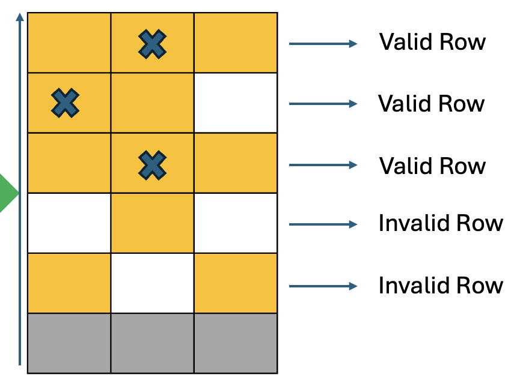
</div>

- Placement logic
  - If top row full → place on new row above starting from the centre then the left side.
  - Else place into the first gap on the current top row.
- `place_tf = "block{place_row}{place_pos}f"`

## Manipulation sequence
- For each robot turn the node sends these actions to the manipulation action server:
  1. `("push_move", push_tf)`
  2. `("pull_move", pull_tf)`
  3. `("place_move", place_tf)`
  4. `("approach_move", WAITING_POS)`
- During `push_move`, if a force stop occurs during push, that block is added to `_immovable_blocks` and the node selects another candidate.
- Goals are sent with an async action client; the node synchronously waits for completion using threading events.
- Rejected goals or failures:
  - During `push_move`: mark attempt unsuccessful and retry with another block.
  - During `pull_move` or `place_move`: treat as non-recoverable, log error, set `/ui/robot_turn = False`, and exit loop.

## Force monitoring and safety
- Subscribes to `/prongs/force_g` (`std_msgs/Float32`).
- Configurable parameter `threshold_g` (default `50.0` g).
- On force callback:
  - If reading > `threshold_g`:
    - Log warning and publish `Bool(data=true)` once on `/safety/stop`.
    - If `_current_push_block` set, add it to `_immovable_blocks`.
- This integrates physical feedback into strategic decisions by avoiding immovable blocks.

## Usage
```
cd ~/jenga_ws
colcon build --packages-select brain_node
source install/setup.bash
```
```
ros2 launch brain_node brain.launch.py
```

## Topics and action interface

**Subscriptions**
- `/vision/tower` — `tower_interfaces/msg/Tower` — tower occupancy.
- `/prongs/force_g` — `std_msgs/msg/Float32` — gripper force (g).
- `/ui/player_done` — `std_msgs/msg/Bool` — player signals done.

**Publications**
- `/safety/stop` — `std_msgs/msg/Bool` — emits `True` when force exceeds threshold (ESTOP pulse).
- `/prongs/mode` — `std_msgs/msg/String` — sends `"cf"` once at startup to close prongs.
- `/ui/robot_turn` — `std_msgs/msg/Bool` — `True` while robot is executing moves; `False` during player turn.

**Actions**
- `/manipulation_action` — `manipulation/action/Manipulation` — request `push_move`, `pull_move`, `place_move`, `approach_move` using named TF frames (e.g., `block72b`).

Runtime behavior:
- On startup the node logs it is watching `/prongs/force_g` and waits for `/manipulation_action`.
- On player trigger: switches to robot turn, selects block, executes the four-step sequence, returns to `WAITING_POS`, sets `/ui/robot_turn = False`, and waits for next signal.
- If force exceeds `threshold_g` during push: a warning is logged, `/safety/stop` pulses `True`, and the block is added to immovable set.

# 3.4. Technical Components: UI Node
The UI node provides a simple graphical interface (Tkinter-based) that allows a human player to interact with the robot during the Jenga game. It is responsible for:

- Coordinating turn-taking between the robot and the human.
- Allowing manual testing of the gripper modes.
- Displaying live force readings from the end-effector.

The node runs a ROS 2 node in a background thread while Tkinter handles the GUI in the main thread.

- Displays a "Start / Next Move" button.
- When pressed, publishes True on /ui/player_done.
- Button is automatically disabled during robot motion.
- Shows live force readings from /prongs/force_g:
  - Green if below threshold (e.g., < 50 g)
  - Red if above threshold

Contains three gripper mode buttons:
- `o` -> open
- `cp` -> grip block
- `cf` -> close fully

These modes are published on `/prongs/mode`.

Subscribes to `/ui/robot_turn` to know when the robot is moving:
- True -> disables the Start button and shows "Robot is moving…"
- False -> enables the Start button and shows "Your turn…"

<div align="center">
  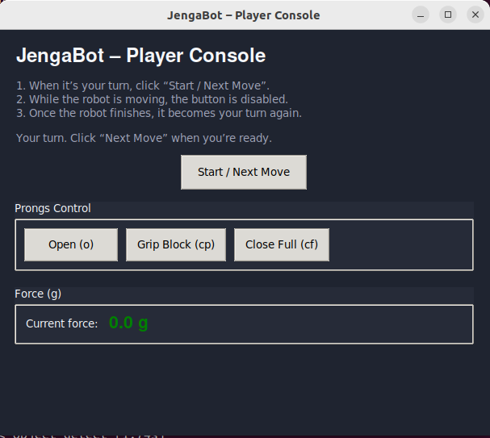
</div>

## Usage

```bash
cd ~/ros2_ws
colcon build --packages-select ui_node
source install/setup.bash
```

```bash
ros2 run ui_node player_gui
```

## Topics

**Subscriptions**

| Topic | Type | Description |
|-------|-------|-------------|
| `/ui/robot_turn` | `std_msgs/msg/Bool` | Controls enabling/disabling of the Start button. |
| `/prongs/force_g` | `std_msgs/msg/Float32` | Displays live force reading from the gripper. |

**Publications**

| Topic | Type | Description |
|-------|-------|-------------|
| `/ui/player_done` | `std_msgs/msg/Bool` | Indicates the human is ready for the robot to proceed. |
| `/prongs/mode` | `std_msgs/msg/String` | Sends open (`"o"`), grip (`"cp"`), or close (`"cf"`) commands. |


---

# 3.5. Technical Components: Closed-loop operation

Closed-loop operation is achieved by the [brain node](#33-technical-components-brain-node), which is able to coordinate a closed-loop round of Jenga.

JengaBot takes inputs from the [force sensor](#36-technical-components-custom-end-effector) and the [computer vision](#32-technical-components-computer-vision) to understand the state of the game. The outputs then are used to control the robot via the [manipulation](#31-technical-components-manipulation) and the [end effector](#36-technical-components-custom-end-effector) nodes.

Hence, the tower is recognised in different locations and orientations and the system understands and adapts when the tower moves, or blocks are removed. The inputs are updated and used in real time, so JengaBot can respond to changes to the tower mid-game.

Closed-loop operation is also implemented via the use of the [force sensor](#36-technical-components-custom-end-effector), which is used to determine the optimal blocks to remove. The [brain node](#33-technical-components-brain-node) listens to the [force sensor](#36-technical-components-custom-end-effector) to determine whether a block is removable. Further detail about how this is implemented is shown in the [state machine diagram](#state-machine-diagram).

---

# 3.6. Technical Components: Custom End-Effector 

## Features

**Lightweight 3D-Printed Frame**  
The JengaBot end-effector is built from a **lightweight 3D-printed structure**.  
It includes **two grippers** and **two servos**.  

**Gripper Motion**  
Horizontal movement of the grippers is achieved through a **gear–rack mechanism**.  
This motion is **directly driven by servo rotation**.  

**Force Sensor Integration**  
One gripper tip is equipped with a **pressure force sensor**.  
This sensor determines whether a block can be pushed without destabilising the tower.  

**Servo Control**  
Servos are controlled by an Arduino Nano.  

## Iterations

Due to geometric constraints and issues found during development, the design underwent multiple iterations. 

**Version 0.0 (Prototype for MVP)** 

This is a simple prototype, only functional for pushing the blocks and providing the end effector pose for research and tests. 

[missing images]

**Version 1.0:** 

Original design (See figure below) 

<div align="center">
  
</div>

**Version 2.0:**  

Enlarged the servo mounting holes and optimized the structure to improve the convenience and accuracy of FDM printing.

**Version 3.0 (Final):**  

Adjusted the orientation of the mount to better align with the kinematics code, positioning the gripper further forward to reduce obstruction during motion.

<div align="center">
  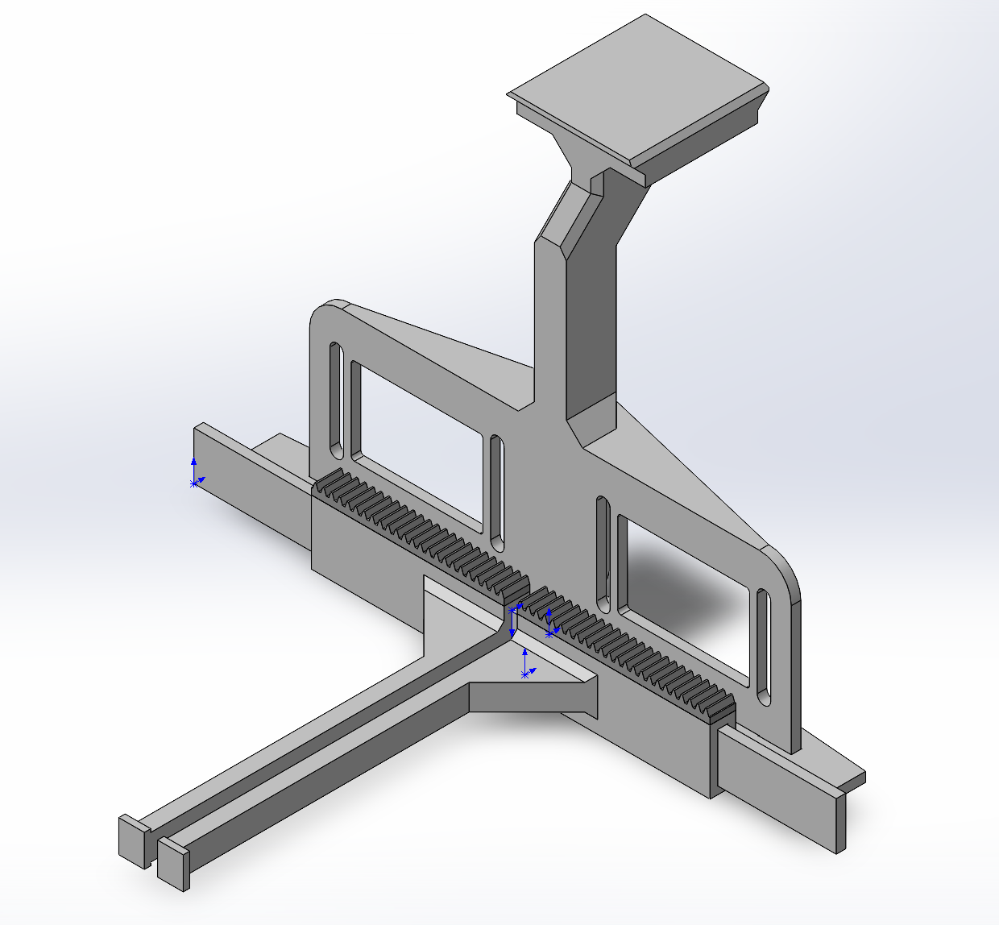
</div>

<div align="center">
  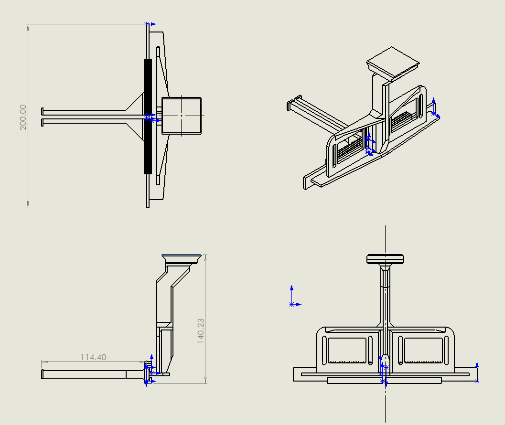
</div>
<div align="center">
  
</div>

---

# 3.7. Technical Components: System Visualisation

The robot features two simultaneous windows used for system visualisation:
  1. A custom UI,
  2. RVIZ

The custom UI indicates the state of the game, i.e. whether it is the User's or Robot's turn to remove a block.

When the 'Start / Next Move' button is clickable, the user is free to take their turn. When it is greyed out, the robot is taking its turn.

<div align="center">
  
</div>

RVIZ displays the state, position and orientation of each block in the tower, based on output from the `object_detect` node. The UR5e and attached end effector is displayed, indicative of all current joint positions and orientations. 

<div align="center">
  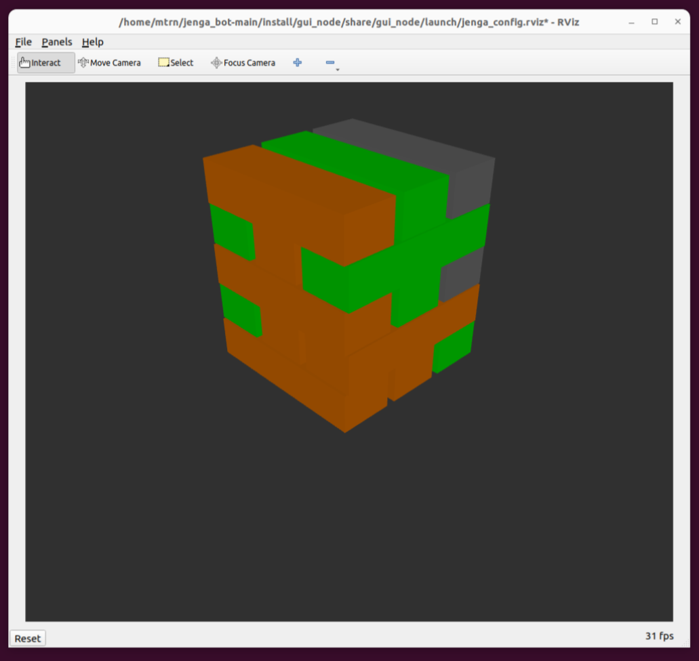
</div>


--- 

# 4. Installation and setup

1. Prerequisites
- OS: Ubuntu 22.04  
- ROS 2: Humble 
- Build tools: `colcon`, `python3-colcon-common-extensions`, `git`  
- UR stack: `ur_robot_driver`, `ros2_control`, MoveIt 2  
- Tools: `rviz2`, `tf2_ros`  

Follow the official ROS 2 Humble install guide, then install the UR driver and MoveIt packages on the same machine that will run the JengaBot stack.

2. Workspace setup
- Create workspace and clone the repo:
```bash
mkdir -p ~/jenga_ws/src
cd ~/jenga_ws/src
git clone https://github.com/robert-cameron/jenga_bot.git jenga_bot
cd ~/jenga_ws
```
- Source ROS 2 and build:
```bash
source /opt/ros/humble/setup.bash
cd ~/jenga_ws
colcon build
source ~/jenga_ws/install/setup.bash
```
- Key packages available after build: `brain_node`, `manipulation`, `object_detect`, `ur_description_custom`, `ur_moveit_config_custom`, `end_eff_bridge`, `ui_node`.

3. Hardware setup
3.1 UR5e and network
- Configure ROS2 Humble and the UR5e robot according to the documentation abd ensure both systems are on the same network.


3.2 Camera and vision
- Mount an RGB-D camera with a clear view of the tower and the ArUco Markers.
- The tower scripts (`real_tower.sh` / `fake_tower.sh`) define:
```bash
WORLD_FRAME="world"
TABLE_FRAME="table"
TOWER_BASE_FRAME="tower_base"
TOWER_X=0.6
TOWER_Y=0.2
TOWER_Z=0.03
TOWER_YAW_DEG=45
```
- Edit these values so `tower_base` matches the physical tower centre (after hand–eye calibration). As long as `/vision/tower` publishes in the robot frame (or a fixed TF exists), the brain node will operate.

3.3 End-effector (gripper + force sensor)
- Print the end-effector body (located in the SolidWorks files folder)
- Attach the 2 DSS P05 Servos and the RP-S5-RT force sensor to the end-effector as shown above.
- Firmware (PlatformIO, Arduino Nano):
- Download the code from the following file:
```bash
cd embedded/"end_eff/src/main.cpp"
```
Connect the Components according to the Wiring Diagram Below:
<div align="center">
  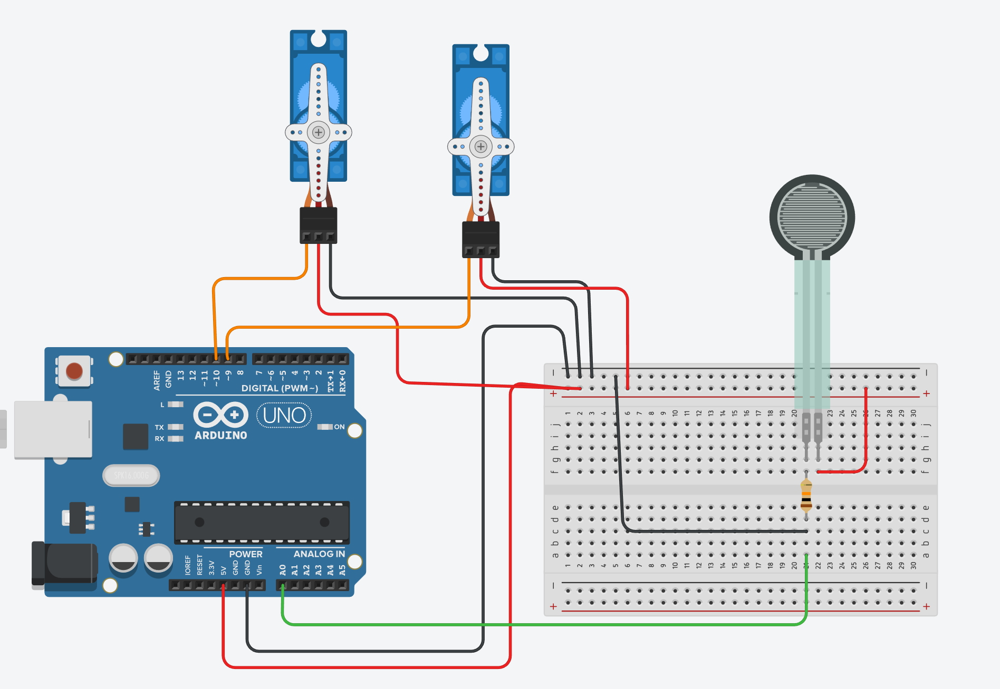
</div>

- Firmware functions: drive servos to preset positions and stream force readings (grams) over serial.
- Wiring: mount the Arduino, connect servos to PWM pins defined in `src/main.cpp`, wire force sensor as per schematic, and power from a regulated supply (shared ground with robot/PC).
- Serial bridge: connect the microcontroller to the ROS PC via USB and confirm device path:
```bash
ls /dev/ttyUSB* /dev/ttyACM*
```
- Default bridge command:
```bash
ros2 run end_eff_bridge bridge --ros-args -p port:=/dev/ttyUSB0 -p baud:=115200
```
- The bridge publishes `/prongs/force_g` (`std_msgs/Float32`) and listens on `/prongs/mode` (`std_msgs/String`) for `"o"`, `"cp"`, `"cf"`.

4. Environment, configuration, and calibration
- Always source ROS and the workspace before running scripts:
```bash
source /opt/ros/humble/setup.bash
source ~/jenga_ws/install/setup.bash
```

- Tower TF and geometry (frames, block sizes, layers) are configured in `real_tower.sh` / `fake_tower.sh`. Adjust to match your physical setup.
- Force threshold parameter on the brain node defaults to 50.0 g. 
- Hand–eye calibration: ensure TF connectivity between UR5e base, table/world, and tower frames. No calibration code is required in this repo if TFs are published correctly.

### Troubleshooting

| Error | Possible Cause | Fix |
|--------|----------------|-----------|
| Servos on the end-effector do not move and are not torqued | The servos are not powered on | Recheck the wiring and try a seperate power supply to power the servos. |
| `setupRealur5e.sh` fails to connect to robot | Wrong `robot_ip` or network mismatch | Confirm you can `ping <robot_ip>` from the PC; update `robot_ip:=...` in `setupRealur5e.sh`; ensure PC and UR5e are on same subnet. |
| No `/prongs/force_g` messages | End-effector bridge not talking to the board | Check `ls /dev/ttyUSB* /dev/ttyACM*`; update the `port` parameter in the bridge command; verify correct baud (115200) and that the Arduino is flashed and powered. Sometimes hitting the reset button or unplugging and plugging in the cable fixes it. |
| Gripper commands (`"o"`, `"cp"`, `"cf"`) do nothing | `/prongs/mode` not received by bridge | Run `ros2 topic echo /prongs/mode` to confirm UI/brain are publishing; check `ros2 node info <bridge_node>` to ensure it subscribes to `/prongs/mode`. |
| Brain node logs “No tower data yet; using hard-coded fallback” | Vision / tower TF not running or misconfigured | Start `real_tower.sh` / `fake_tower.sh` and vision node; confirm `/vision/tower` is publishing and that `tower_base` appears in `ros2 run tf2_tools view_frames`. |
| RViz / MoveIt cannot see the tower | TF frames not aligned or missing | Check TF tree for `world`, `table`, `tower_base`, `blockXYf/b`; adjust `TOWER_X/Y/Z` and `TOWER_YAW_DEG` in `real_tower.sh` to match the physical tower. Ensure the camera can see 2 sides of the tower|
| Brain always E-stops immediately / does not detect immovable blocks | Force sensor offset / threshold too low | Echo `/prongs/force_g` at rest; Test the peak force received from an immovable block just as the prong touches it and set `threshold_g` in the brain_node to that value. |
| UI window launches but Start button always disabled | `/ui/robot_turn` stuck at `True` | Check that the brain node is running and toggling `/ui/robot_turn`; if testing UI alone, you can manually publish `False` on `/ui/robot_turn`. |


# 5. Running the System

### Step 1: Startup Script

Run the following script from within the `/jenga_bot` directory:

```
./setupRealur5e
```

This script will `colcon build` the solution and open the following tabs in the terminal:

- DriverServer
- MoveitServer
- ManipulationServer
- EndEffServer
- BrainServer
- PlayerUI
- Realsense
- Static Camera
- RealTower
- ObjectDetection

Wait up to 30 seconds for the nodes to start up. The UI and RVIZ will launch automatically when this script is run.

Once all nodes have started, run the `ros` script from the UR5e teach pendent.

The robot is now ready! Interact with it via the UI.

NOTE: alternatively, run `./setupFakeur5e` to use simulated hardware. This script was used for testing and hence, it will only run nodes necessary for manipulation - it will not run computer vision. 

### Step 2: Calibration

After setting up the robot, the camera transformation needs to calibrated.

First, move the robot arm so the end effector is positioned just before the touching point if it was doing a push move for block at row 4 position 2 on the side of the tower which is closest to the base of the UR5E. When doing this do not use free move, rather use the manual move controls as it is important that the final link in the robot remains vertical for the calibration process to work.

Next, run the following script from within the `/jenga_bot` directory:

```
./calibrate.sh
```

This script will create a tranformation for that specific block and then run the camera calibration node to find the transformation between the camera and the base link.

Copy the tranformation static publisher that was created and run it in a new terminal tab after ending the exisitng base_link to camera_link transformation publisher.

The robot is now calibrated you should see the tower lining up with the end effector in rviz.

### Step 3: Play Jenga

Setup a jenga tower on the Jenga base plate and then press the start turn button on the UI to start the JengaBot's turn.

### Troubleshooting

- After running `./setupRealur5e`, it is recommended to manually open/close the end effector via the UI. This ensures that the end_eff_link is running and communicating with the Arduino correctly. 
  - If the end effector does not respond, restarting the Arduino generally fixes this.
- If the robot does not move when expected, stop and restart the `ros` script from the UR5e teach pendent.
- If movement suddenly stops, it is likely that the UR5e joint limits would be exceeded by moving to the next position. Move the jenga tower into a more suitable location and restart the robot.
- If the object detection node does not output show an image dialog box, it is likely that this node will need to be restarted. This can be done by running the following command in a new terminal tab: `ros2 run object_detect object_detect`

---

# 6. Results and Demonstration
## 6.1 Demonstration

### Block Manipulation
<table>
  <tr>
    <td align="center">
      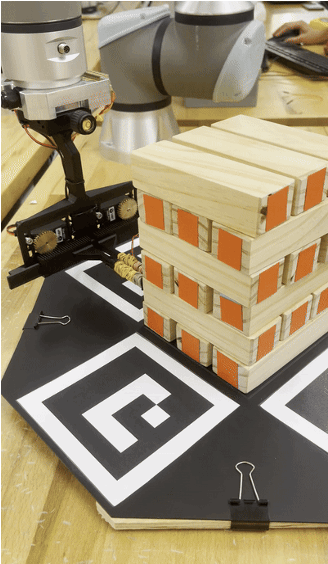<br/>
      <b>Block Pick</b>
    </td>
    <td align="center">
      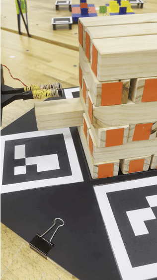<br/>
      <b>Block Pull</b>
    </td>
    <td align="center">
      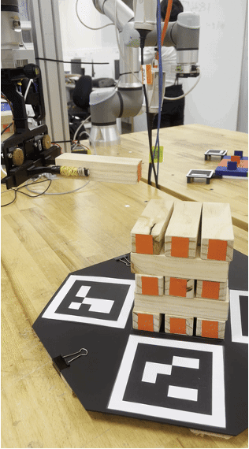<br/>
      <b>Block Placement</b>
    </td>
  </tr>
</table>

### Full Demonstration

[Watch the full demonstration on YouTube](https://youtu.be/ButhJ49mhdo)


## 6.2 Quantitative Evaluation

From the system requirements set out at the beginning of the project, we were able to evaluate the result of the final product against these:

| Metric | Expected Performance | Measured Result |
|-------|------------------------------------------|-----------------|
| **Game Play** | Able to remove blocks and replace on top of tower | Reliably probed, pushed, pulled and placed blocks on top of tower |
| **Speed** | Turn completed inside 2 minutes | Complete turn takes 1 min 32 seconds on average |
| **Repeatability** | Able to take 2+ consecutive turns | Reliably can take atleast 3 turns without fail |
| **Robustness** | Adjusts to major changes in tower position | System can handle rotations of any degree, repositioning of the tower, and removal of blocks from the tower at any stage of gameplay. |
| **Accuracy** | Block placement alignment within 1 cm | Probes reach the centre of the block within a 5mm tolerance and can safely pick up blocks with a 2 cm offset, where it then places the block on the top within a 5mm tolerance |
| **Block Detection Accuracy** | Correctly detect ≥ 90% of blocks per frame | Correctly detects 100% of blocks in the tower |
| **Force Stop Trigger Latency** | Trigger within ≤ 100 ms of crossing force threshold | Median trigger latency of 62 ms from threshold crossing |

---

# 7. Discussion and Future Work

We have created a successful implementation of JengaBot, but there were challenges in the implementation of this project. First of all with manipulation we had challenges using moveit planning and execution when putting in a collision opsticle for the tower so robot would not run into the tower, to solves this we made a custom path planning algorithm that determines which face the robot is on and then choses points on each of the corners to move between 2 points on the tower. This solution was highly effective and meant that we had very smooth movement of the robot. We also found that increasing the speed of this cause the robot to be unreliable when chaining the movements together, for this reason we maintained our orginial slower speed.

Vision also had many challenges, originally we were using a normal sized Jenga tower and the depth camera to both work out the location of the tower and to detect which blocks were in the tower, however this was not very accurate as depth information at the distance we were using was inaccurate and would change with time leading to noise in the tower moving around on the visualisation. To combat these issues we decided to incrase the size of the tower, increasing the resolution of the camera and moving away from using the depth camera. We achieved this by using SolvePNP to locate the aurco markers instead of depth and then doing the calulations to determine which countout matched which block in the image rather than finding the points that related to in the real world, this greatly improved the accuracy of the detection and allowed us to achieve a reliable approach to locating the tower and which blocks were in it.

Another challege was todo with joint limits, we found that with our larger tower and end effector there was not much space at which the UR5E robot arm could reach all sides of the tower and fail to execute a move as it could not reach the desired position, for testing in this version we just had to position the tower within the limiting box. This will need to be addressed in future versions of the system.

Our final challenge was the force sensor on the end effector, we found that mounting such a small sensor on the end effector was difficult to do well and after mounting it we found that it gave inconsistent readings between testing sessions with sensors falling apart and breaking causing the thresholds having to be recalibrated. In fact right before our final demonstration we had issues with the force sensor giving bad readings and we had to adjust how the sensor was mounted to get it to work. Further we had challenges with getting the block pushed most of the way out and but then right at the end the force increases above the threashold causing the robot to think this block is immovable and leaving a block half way through the tower, this issue will need to be solved in future versions of the system with either an algorithm to only cancel when at the start of the movement or a better force sensor and mounting solution.

Some other future improvements would be to redesign the end effector to make it smaller and better able to reach around the tower so that we aren't as constrained by joint limits. To continue developing the vision system removing the remaining bugs and issues from when the tower is in a less optimal position. Potentailly also use a larger robot arm which is less constrained by joint limits and would allow us to move the robot around the tower more easily.

Overally we believe our soliution to be a novel approach that effectively and reliably plays the game of Jenga, It has effectly integrated multiple systems from vision and force sensing to robot arm control and manipulation. We found that the simplistic motion controller and reliability of vision outputs allowed us to create a system that was reliablly able to solve the given problem. 

We hope that this project will inspire others to take on similar challenges and that we can continue to improve the system to make it even more effective.

---

# 8. Contributors and Roles
- **Robert Cameron** - Manipulation
- **Thomas Crundwell** - Vision
- **Akhil Govan** - Brain
- **Haoran Wen** - End effector

---

# 9. Repo structure

This repository is organized around ROS2 packages, Arduino code for the end effector, and supporting resources:

- `src/`: ROS2 workspace containing packages for the brain, manipulation, vision, UI, end-effector bridge, UR description, and tower message interfaces.
- `embedded/`: Arduino source code and reference images for the custom end effector electronics.
- `image/`: Diagrams and photos used in the README to illustrate system architecture, vision pipeline, and hardware.
- `solidworks/`: CAD assemblies and parts for the robot’s custom gripper and mechanical components.
- Top-level helper scripts (`setup*.sh`, `fake_tower.sh`, `real_tower.sh`) streamline environment setup and tower configuration for testing.

NOTE: after running `colcon build` from the `/jenga_bot` directory, expect the following additional folders to appear
- `build/`
- `log/`
- `install/`

---

# 10. References

We would like to acknowledge the the help of our tutor David and the rest of the teaching team who were very helpful in the development of this project and supported us in developing solutions to the problems we faced.

- Code was adapted from the lab material from the MTRN4231 course.
- [Ros2 Documentation](https://docs.ros.org/en/humble/index.html)
- [OpenCV Documentation](https://docs.opencv.org/4.x/index.html)

Inspiration: [https://www.youtube.com/watch?v=o1j_amoldMs](https://www.youtube.com/watch?v=o1j_amoldMs)

---
